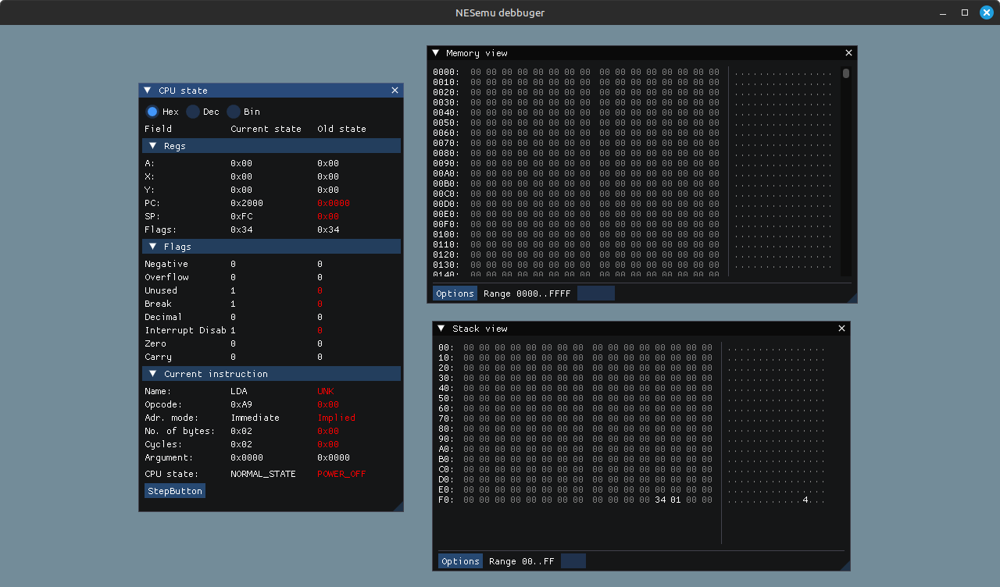

# NESemu

## Build

Download dependencies:

```sudo apt install cmake libsdl2-dev g++```

Use cmake with make to build.

## State

CPU needs testing and fixes. Debbuger is operational. Rest of the components ought to be written.